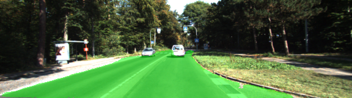
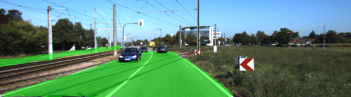
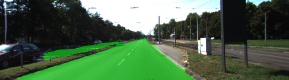

# CarND-Semantic-Segmentation-P2
Self-Driving Car Engineer Nanodegree Program - Semantic Segmentation Project

## Goal 
In this project, the goal is to setup a Fully Convolutional Network (FCN), train the model and then use it to label the pixels of a road in images. The paper of FCN-8 architecture can be downloaded here: 
https://people.eecs.berkeley.edu/~jonlong/long_shelhamer_fcn.pdf 

## Setup
#### Frameworks and Packages
Make sure you have the following is installed:
 - [Python 3](https://www.python.org/)
 - [TensorFlow](https://www.tensorflow.org/)
 - [NumPy](http://www.numpy.org/)
 - [SciPy](https://www.scipy.org/)

#### Dataset
Download the [Kitti Road dataset](http://www.cvlibs.net/datasets/kitti/eval_road.php) from [here](http://www.cvlibs.net/download.php?file=data_road.zip).  Extract the dataset in the `data` folder.  This will create the folder `data_road` with all the training a test images.

In this project I am using the workspace Udacity provided, and the dataset is ready under `/data`.

## Run
Run the following command to run the project:
```
python main.py
```

## Implementation 
#### Network design 
The code downloads a pre-trained VGG16 model and extract the outputs of certain layers, based on these outputs I created the rest of the network (in lines 62~91) which consists of: 
* 1x1 convolution layers * 3
* upsample layers *3 
* skip connection layers  *3   

## Result 
For training the model I have tried the epochs with number 10, 20 and 50. 
* Epochs with 10 -> Loss = 0.1   (Time-consuming: 750s)
* Epochs with 20 -> Loss = 0.05  (Time-consuming: 1500s)
* Epochs with 50 -> Loss = 0.02  (Time-consuming: 3700s)

Following are sample images processed by our final FCN network. 
   
   
   

## Conclusion 
The core of the solution is FCN: 
1. Replace fully connected layers with one by one convolutional layers
2. Up-sampling through the use of transposed convolutional layers
3. Skip connections, which allow the network to use information from multiple resolution scales

PS: Each convolution and transpose convolution layer includes a kernel initializer and regularizer, which indeed improve the training efficiency quite a lot. 
